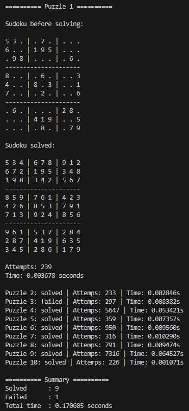

# Sudoku Solver (Python)

A Sudoku solver implemented in Python using **recursive backtracking**.  
The solver was later optimized using the **Minimum Remaining Value (MRV) heuristic** to reduce the search space and improve performance.

## Features
```
- Recursive backtracking solver
- Sudoku constraint validation (row, column, 3×3 box)
- Multi-puzzle solving from `puzzles.txt`
- Step counter (number of search attempts)
- Execution time measurement
- MRV heuristic optimization
```
## Puzzle Format

Each puzzle must be written as **81 digits in a single line**.

Example (`puzzles.txt`):
```
530070000600195000098000060800060003400803001700020006060000280000419005000080079
600120384008459072000006005000264030070080006940003000310000050089700000502000190
```

`0` represents an empty cell.

## Run the Solver

From the project directory:

```bash
python sudokusolver.py
```
The solver will:
- load puzzles from puzzles.txt
- solve them sequentially
- display the first puzzle in detail
- show summary results for the rest

## Output



## Optimization

```
Applying the MRV heuristic significantly reduces the search space.
Example improvement on harder puzzles:

Basic backtracking : ~2,000,000 attempts
MRV heuristic      : ~7,000 attempts
```
